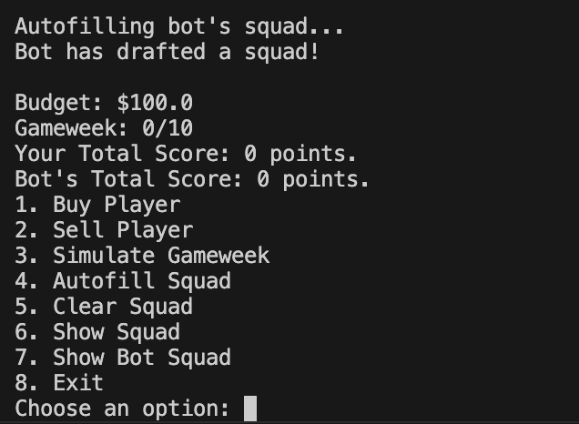

# README

Our CSV file is a database with 100 different players to choose from with their name, club, position, and price all written on each line

To compile and run, type in command line: 

```zsh
g++ fpl.cpp -o fpl
./fpl
```

Should look like this in the terminal once completed

# Futbol-Prem-League
